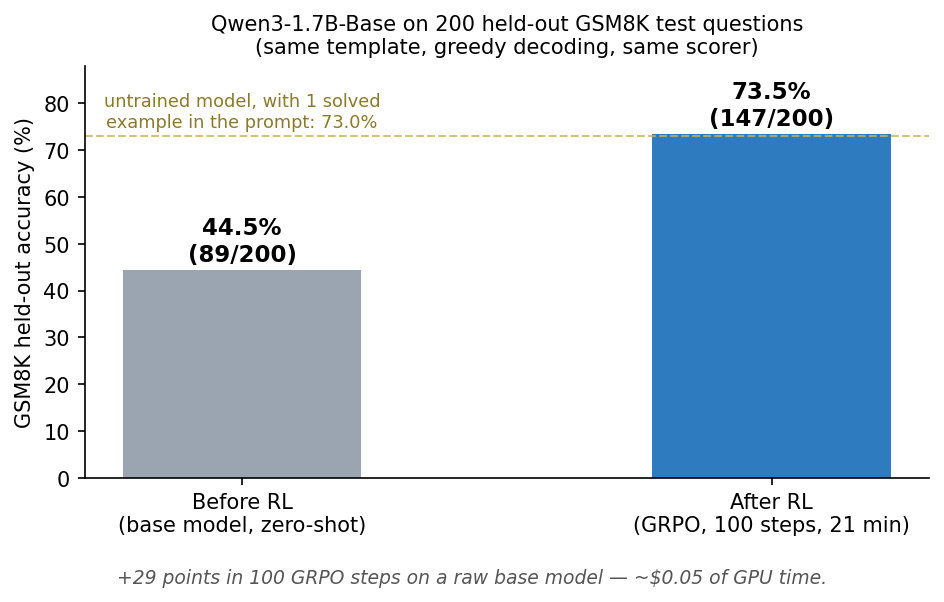
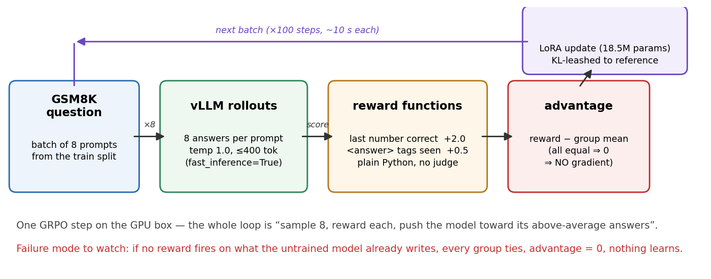
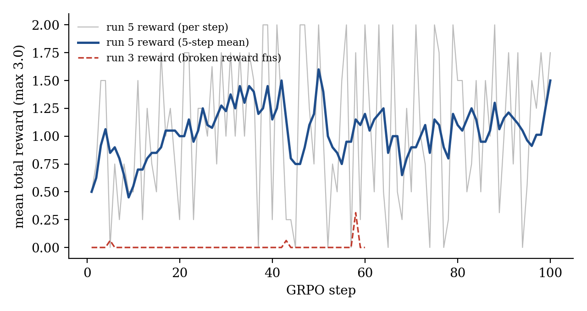
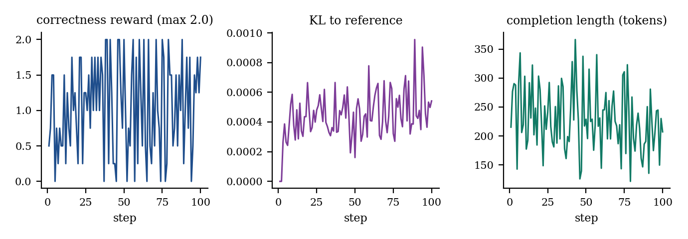

# Do Reinforcement Learning on a Real LLM — GRPO, step by step, on a $0.10/hr GPU

**plain:** rent a $0.10/hr GPU, RL-train a small LLM on math with GRPO
(Unsloth + TRL + vLLM), verify the gain on a held-out benchmark, download
the model. ~1.5 hours, ~$0.30. You hand-write only the reward functions.



Executed 2026-07-04 (RTX 5060 Ti, 16 GB). Two experiments, both scored on
200 held-out GSM8K test questions, greedy decoding:

- **Experiment 2 (figure above): raw BASE model** (Qwen3-1.7B-Base, no SFT,
  no chat template — the R1-Zero recipe): **44.5% → 73.5% in 100 steps**
  (21 min, ~$0.05). Its 1-shot score was already 73.0% — RL made that
  reliable zero-shot. Details in [Appendix E](#e-experiment-2-grpo-on-a-raw-base-model-the-r1-zero-effect).
- **Experiment 1 (the walkthrough below): instruct model**
  (Qwen2.5-1.5B-Instruct): 62.5% → **64.5%** in 100 steps (17.5 min).
  300 steps — still 64.5%. (Its training-rollout accuracy showed 35% → 61%;
  that number overstates the gain ~10×.)

**Same recipe: +2 points on a post-trained model, +29 on a base model.**
RL mostly surfaces ability the model already has.

---

## Current track — [`bench/`](./bench): beat official Qwen3.5-0.8B, apples-to-apples

Take `Qwen/Qwen3.5-0.8B-Base`, run *our* GRPO on it, compare vs Qwen's official
`Qwen/Qwen3.5-0.8B` on the same GSM8K + MATH-500 board. Same base, same size —
only the post-training recipe differs.

Baseline of the official model (n=100, RTX 5060 Ti, 2026-07-09):

| bench | mode | pass@1 | note |
|-------|------|--------|------|
| GSM8K | terminating (`--no-think`) | **48.0%** | real capability baseline |
| GSM8K | thinking on | **11.0%** | documented thinking-loop — 100% of traces never close `</think>`; an artifact of non-termination, not capability |
| MATH-500 | terminating (`--no-think`) | **33.0%** | floor — 46% still hit the token cap, under-counted |

Thinking mode *lowers* GSM8K by looping instead of stopping. Fixing termination
while keeping real reasoning is what GRPO targets here. Scoreboard harness +
reproduce steps in [`bench/`](./bench).

---

## PART 1 — Do this, top to bottom

> **Stuck on SSH / renting the GPU? Paste this into ChatGPT/Claude/any AI:**
>
> ```text
> Help me set up SSH access to a Vast.ai GPU instance, step by step, checking
> my output at each step. My OS is [Mac/Windows/Linux]. Walk me through:
> (1) creating an SSH keypair if I don't have one (check with
>     `ls ~/.ssh`) and showing me the public key to copy;
> (2) where to paste that key on https://cloud.vast.ai/account/;
> (3) renting an instance: PyTorch template, 1 GPU with 16 GB VRAM,
>     ≥60 GB disk, ~$0.10–0.20/hr;
> (4) connecting with the ssh command Vast shows me (I'll paste it here),
>     and what to do if I get "Permission denied (publickey)" or a
>     host-key warning;
> (5) verifying I'm in: `nvidia-smi` should show the GPU and
>     `source /venv/main/bin/activate` should activate Python.
> Ask me what I see after each step before giving the next one.
> ```

### 1. Rent the GPU

1. Go to **https://cloud.vast.ai** → sign up → add ~$5 credit (Billing tab).
2. Add your SSH key: **https://cloud.vast.ai/account/** → paste the output of
   `cat ~/.ssh/id_ed25519.pub` (make one with `ssh-keygen -t ed25519` if you
   don't have it).
3. Go to **Templates** → pick **PyTorch (Vast)** (any recent CUDA PyTorch
   template works).
4. In the search filters: **GPU = 1x RTX 5060 Ti / 4070 / anything with 16 GB
   VRAM**, disk ≥ 60 GB. Sort by price, rent one ~$0.10–0.20/hr.
5. When it's running, click the **>_ (connect)** button and copy the SSH
   command. It looks like:

```bash
ssh -p 12547 root@46.49.115.184 -L 8080:localhost:8080
```

### 2. Connect and check the box

```bash
ssh -p <PORT> root@<IP>          # paste your command from step 1.5
nvidia-smi                        # should show your 16 GB GPU
source /venv/main/bin/activate    # the template's Python env — do this EVERY ssh session
```

⚠️ On this template `/workspace` is **deleted when you destroy the instance**.
Everything you want to keep gets `scp`'d back in step 8.

### 3. Install the training stack (~10 min)

On the box:

```bash
uv pip install unsloth trl vllm
python -c "from unsloth import FastLanguageModel; from trl import GRPOTrainer; import vllm; print('ok')"
```

What each package actually does in this run:

| package | role here |
|---|---|
| **unsloth** | Memory/speed layer. Loads the model 4-bit, patches attention kernels, wires LoRA — the reason a 1.5B model + RL fits in 16 GB. Also *code-generates* its trainer from trl's source (that's why versions must match, Appendix A). |
| **trl** | HuggingFace's RL-training library. Provides `GRPOTrainer` — the loop that samples, scores, computes advantages, and takes the policy step. We write reward functions; trl does the rest. |
| **vllm** | Fast inference engine. GRPO spends most of its time *generating* rollouts (8 per prompt per step); vLLM makes that ~10× faster than plain `model.generate()`. Unsloth drives it via `fast_inference=True`. |
| **torch / transformers** | Pulled in automatically — the tensor engine and the model/tokenizer classes. You never import them directly in the script. |
| **uv** | Just a faster `pip` (preinstalled on the Vast template). `pip install` works too, slower. |

Do **not** pin trl to an old version (see Appendix A — it crashes at training
step 0, not at install). Version set that works (2026-07-04):
`unsloth 2026.6.9 · trl 0.24.0 · vllm 0.19.1 · torch 2.10.0+cu128`.

### 4. Get the training script

Two files in this folder — no edits needed to reproduce the run:

- [`grpo_train.py`](./grpo_train.py) — the full training script (~130 lines)
- [`probe.py`](./probe.py) — prints raw model outputs (used in step 6)

From your **laptop**:

```bash
ssh -p <PORT> root@<IP> "mkdir -p /workspace/grpo-unsloth"
scp -P <PORT> grpo_train.py probe.py root@<IP>:/workspace/grpo-unsloth/
```

### 5. What the script does (30-second version)



- Loads **Qwen/Qwen2.5-1.5B-Instruct** in 4-bit + LoRA rank 16 (only 1.18% of
  weights train → fits in 16 GB next to vLLM).
- Dataset: **GSM8K** (grade-school math, 7,473 problems, from HuggingFace —
  downloads automatically).
- Rewards (all just Python functions, no judge model):
  - correct final number = **+2.0**
  - `<reasoning>/<answer>` tags present = **+0.5** (shaping)
- GRPO: 8 answers per question → reward each → push the model toward its
  above-average answers. 100 steps, batch 8.

### 5b. The reward functions, line by line (the only part you write yourself)

Everything else is library code. The reward functions are yours, and every
run of ours succeeded or failed here:

**1. `correctness_reward_func` — the actual objective (+2.0)**

```python
def correctness_reward_func(prompts, completions, answer, **kwargs):
    responses = [c[0]["content"] for c in completions]     # 8 rollout texts
    extracted = [extract_last_number(r) for r in responses] # pull a number out
    return [2.0 if e == a else 0.0 for e, a in zip(extracted, answer)]
```

- Input: the 8 completions the model just generated for one question, plus
  the GSM8K gold answer. Output: one float per completion. That's the whole
  contract — a reward function is just `list[str] -> list[float]`.
- The critical design choice is inside `extract_last_number`: it grades the
  **last number anywhere in the text**, not just inside `<answer>` tags. Why:
  we probed the untrained model (Step 6) and it ignores the tag format
  completely — it writes "Therefore, the answer is 72 clips." If we only
  graded inside tags, all 8 rollouts would score 0, every advantage would be
  0, and there would be literally no gradient (that was our run 1–2, see
  Appendix B).

**2. `soft_format_reward_func` — the ladder rung (+0.5)**

```python
def soft_format_reward_func(completions, **kwargs):
    responses = [c[0]["content"] for c in completions]
    return [0.5 if ("<reasoning>" in r and "</reasoning>" in r
                    and "<answer>" in r and "</answer>" in r) else 0.0
            for r in responses]
```

Pays for using both tag pairs *anywhere*. This is the intermediate rung
between "no tags at all" (where the model starts) and the strict layout
below — GRPO can only climb rungs it occasionally touches by luck.

**3. `format_reward_func` — the target format (+0.5)**

```python
pattern = r"^<reasoning>\n.*?\n</reasoning>\n<answer>\n.*?\n</answer>\n?$"
```

Exact layout, regex-anchored start to end. In our 100-step run this stayed
at 0.0 the whole time — too few steps for the model to discover it — and
that's fine: it's shaping, not the objective.

**How to know they're not being hacked:** watch the per-function means in the
log. Healthy run = `correctness_reward_func/mean` climbing;
reward-hacked run = format means saturated while correctness is flat (the
model found the cheap +1.0 and stopped caring about math). Ours ended at
correctness ≈ 1.5/2.0 with format still 0.0 — all the learning went into
getting answers right. We also read the trained model's raw completions
(same trick as Step 6, with `--adapter`): normal step-by-step arithmetic,
no degenerate "just print a number" collapse.

### 6. (Recommended) Probe before training

On the box:

```bash
cd /workspace/grpo-unsloth
HF_HOME=/workspace/.hf_home python probe.py | tail -20
```

Read the raw outputs. **At least one reward function must score > 0 on what
the untrained model already writes** — otherwise GRPO has zero gradient and
the run learns nothing (this exact failure burned our first two runs, see
Appendix B). The shipped script already handles this: it grades the last
number in the text, so it fires from step 1.

### 7. Launch training (~20 min)

From your **laptop** (one command — survives SSH drops):

```bash
ssh -p <PORT> root@<IP> "source /venv/main/bin/activate && cd /workspace/grpo-unsloth && HF_HOME=/workspace/.hf_home setsid nohup python grpo_train.py > train.log 2>&1 < /dev/null & echo started"
```

Watch it (Ctrl-C to stop watching, training keeps running):

```bash
ssh -p <PORT> root@<IP> "tail -f /workspace/grpo-unsloth/train.log"
```

Timeline you'll see:
- ~2.5 min: model download (first run only)
- ~1 min: vLLM engine startup
- then `1/100, 2/100, ...` at ~10 s/step
- healthy run = `reward_std` > 0 on early steps and
  `rewards/correctness_reward_func/mean` climbing
- ends with `DONE` after ~18 min

### 7b. Check it actually got better (held-out eval, ~2 min)

The training log's `reward`/accuracy numbers are measured on the questions
the model is actively training on — not proof it generalized. Run
[`eval_gsm8k.py`](./eval_gsm8k.py) on the **test split** (never trained on)
for the real number, base model first then trained:

```bash
scp -P <PORT> eval_gsm8k.py root@<IP>:/workspace/grpo-unsloth/
ssh -p <PORT> root@<IP> "source /venv/main/bin/activate && cd /workspace/grpo-unsloth && HF_HOME=/workspace/.hf_home python eval_gsm8k.py --n 200"
ssh -p <PORT> root@<IP> "source /venv/main/bin/activate && cd /workspace/grpo-unsloth && HF_HOME=/workspace/.hf_home python eval_gsm8k.py --n 200 --adapter outputs/grpo_lora"
```

Each prints one line: `RESULT model=... n=200 correct=... acc=...`. Our run:
base 62.5% → trained 64.5% (see Appendix C.1 for the full breakdown).

### 8. Download your trained model

From your **laptop**, before destroying the instance:

```bash
scp -P <PORT> -r root@<IP>:/workspace/grpo-unsloth/outputs/grpo_lora ./grpo_lora
scp -P <PORT> root@<IP>:/workspace/grpo-unsloth/train.log ./
```

`grpo_lora/` is a 37 MB LoRA adapter — load it on top of the public
Qwen2.5-1.5B-Instruct anywhere. Adapter + script = the full reproducible
artifact.

### 9. Destroy the instance

https://cloud.vast.ai/instances/ → trash icon. Billing stops. (Pausing still
bills storage.)

**You're done.** Expected result, from our run: reward 0.70 → 1.23,
rollout accuracy 35% → 61%, best group all-8-correct at step 38.

---

## PART 2 — Appendix: the failures, so you don't repeat them

### A. Version-skew crash (trl vs unsloth)

Unsloth **code-generates** its trainer from the installed trl's source, so a
mismatch crashes at training step 0 — after the whole model load — with
`AttributeError: image_token_id` or `NameError: truncate_with_protected_tokens`.

Fix (one command), plus two traps inside it:

```bash
uv pip install -U unsloth unsloth_zoo trl vllm torchvision
rm -rf /workspace/grpo-unsloth/unsloth_compiled_cache
```

- Never `uv pip install -U trl` alone — it drags torch to 2.12 and breaks
  vllm (built against 2.10). Upgrade jointly, let the resolver pick.
- `unsloth_compiled_cache/` holds trainer code generated against the OLD trl.
  Delete it after any version change or the old bug keeps executing.

### B. The zero-reward run (the real GRPO lesson)

Our first full run trained 60 steps cleanly with reward **flat at zero**.
Two causes, found from the run's own evidence:

1. `max_completion_length=200` clipped 58% of rollouts
   (log key `completions/clipped_ratio`) → raised to 400.
2. The decisive one: `probe.py` showed the model does correct math but ends
   with *"Therefore, the answer is 72 clips."* — **never** the
   `<reasoning>/<answer>` tags the rewards demanded. Every completion scored
   0 → zero variance within every group → advantage 0 → **no gradient**.

Rule this teaches: **when reward is flat, print completions — don't touch
hyperparameters.** And design a reward ladder with a rung at the model's
current behavior (grade the last number; keep format rewards as shaping).

### C. What the fixed run showed (train5.log, artifacts/)




(Both plotted straight from the run logs by
[`_scripts/build_grpo_gpu_report.py`](../../../../_scripts/build_grpo_gpu_report.py);
the loop diagram above comes from [`make_diagrams.py`](./make_diagrams.py).)

| metric (first 10 vs last 10 steps) | start | end |
|---|---|---|
| correctness accuracy (training rollouts) | **35.0%** | **61.3%** |
| total reward (correctness = 2.0) | 0.700 | 1.231 |
| clipped rollouts | 12.5% | 2.5% |
| mean completion length | 258 tok | 210 tok |
| KL to reference | 0.0003 | 0.0005 |

- Completions got **shorter** as they got better — cutting filler, not
  growing chains of thought.
- The tag format **never emerged** (soft-format ended at 0.006/0.5): GRPO
  amplified what the model could already do (math) and did not conjure what
  it couldn't (a format it has zero prior on). Want tags? Few-shot them or do
  a short SFT pass first. That asymmetry is the most useful intuition here.
- Honesty note: 35% → 61% is on training rollouts (temp 1.0), not a held-out
  benchmark.

### C.1 The real benchmark: held-out GSM8K test set

Ran both the base model and the trained adapter on 200 **test-split**
questions (never seen during training), greedy decoding
(`eval_gsm8k.py`, logs in `artifacts/eval_base2.log` / `eval_lora2.log`):

| model | correct / 200 | accuracy |
|---|---|---|
| base Qwen2.5-1.5B-Instruct | 125 | **62.5%** |
| GRPO-trained, 100 steps (17.5 min) | 129 | **64.5%** |
| GRPO-trained, 300 steps (57 min) | 129 | **64.5%** |

**+2 points, +4 correct answers — real, but modest**, exactly what you'd
expect from a 17.5-min smoke run. The training-rollout number (35%→61%)
looks far more dramatic because it's measured on the questions the model is
actively memorizing/practicing, at temperature 1.0 — always report the
held-out number when the question is "did it actually get better."

**The 300-step run is the second lesson.** We ran the obvious next
experiment — 3× more training (`grpo_train_300.py` variant, log
`artifacts/train6.log`, eval `artifacts/eval_lora300.log`) — and got exactly
the same 129/200. Training reward still crept up (0.85 → 1.08 batch mean),
KL stayed tiny (~0.0005), completions stayed clean step-by-step math (no
reward hacking; per-function log breakdown shows all reward came from
correctness, format rewards ≈ 0 throughout). The extra 40 minutes of GPU
time moved the training metric but not the benchmark: **at this model size,
LoRA rank, and reward design, GRPO's held-out gains saturate by ~100
steps.** Squeezing more out needs a *different* lever (bigger model, higher
LoRA rank, harder data mix, better reward), not more steps — which is a very
common finding in RLVR papers, here reproduced for $0.30.

### D. Ops notes for Vast boxes

- SSH drops constantly; the run doesn't care because of `setsid nohup`. Just
  reconnect.
- After the first run cached the model, add `HF_HUB_OFFLINE=1
  TRANSFORMERS_OFFLINE=1` to the launch so a flaky network can't hang startup.
- Never leave a retrying launch/kill loop running in the background — a stale
  loop will silently kill every new run (this happened to us).

### E. Experiment 2: GRPO on a raw BASE model (the R1-Zero effect)

What does the same recipe do to a model that never saw instruction tuning?
Scripts: `grpo_train_base.py`,
`eval_gsm8k_base.py`, `probe_base.py`; logs in `artifacts/`
(`train_base2.log`, `eval_qwen3base*.log`); adapter `artifacts/grpo_lora_base`.

| checkpoint (Qwen3-1.7B-Base, bf16, same template/scorer) | correct / 200 | accuracy |
|---|---|---|
| zero-shot, R1-Zero-style template | 89 | **44.5%** |
| 1-shot (best-shot reference line) | 146 | **73.0%** |
| GRPO 100 steps, LR 2e-5, zero-shot | 147 | **73.5%** |

**+29 points in 21 minutes (~$0.05 of GPU time).** Fairness contract: both
checkpoints eval with the identical template, stop sequences, greedy
decoding, precision, and answer extraction; baselines were run and logged
*before* training started; the test split was never touched during prompt
or reward design.

The 1-shot row is what keeps the claim honest: RL did not teach the model
math — it taught a raw base model to reliably *access* its own ability
zero-shot (73.5% ≈ its 1-shot 73.0%). That is the R1-Zero phenomenon, and
most dramatic "RL adds 30 points" results have this structure. Before/after
on the same held-out question:

- **Base:** correct arithmetic that dissolves into junk — `.AnchorStyles`
  loops, hallucinated "User:" turns, multilingual token soup — so the
  extracted answer is often garbage.
- **Trained:** clean numbered steps ending in `<answer>20</answer>`. (Also
  cleanly formatted *wrong* answers — format and capability are separate
  things, and RL fixed the format.)

What it took to make this run work (each probe- or log-driven, not guessed):

1. **4-bit quantization wrecks a small base model.** The first probe (bnb
   4-bit) produced near-total degeneracy; bf16 fixed it. Train and eval in
   16-bit for base models this small.
2. **Base models hallucinate follow-up turns.** Rewards and eval must
   truncate completions at `"User:"` before extracting an answer, or you
   grade numbers from invented questions.
3. **A number can be `inf`.** The base model once emitted a digit run big
   enough to overflow `float→int`, crashing the eval mid-run — the
   extraction now guards for it. Reward/extraction code must survive
   *anything* a base model can emit.
4. **Zero-reward batches are normal here.** With 8 rollouts of a single
   question per step, a hard question scores 0 across the group
   (`frac_reward_zero_std: 1.0`) — that's an unlucky batch, not the
   zero-gradient bug of Appendix B. Check the *trend across steps*, not one
   step. (First launch, we misread two unlucky batches as the bug and
   killed the run; the debug dump of raw completions settled it.)
5. **LoRA needs ~10× the full-finetune LR.** This run used 2e-5; the
   instruct run's 5e-6 left KL at ~0.0005 (policy barely moving).

### Where this goes next

- Delete `correctness_reward_func` from `reward_funcs` and watch the model
  reward-hack the format rewards.
- ~~`max_steps=300` + a held-out eval~~ — done, see C.1: saturates at 64.5%.
  The open question is now *which lever breaks the plateau*: LoRA rank 64,
  a 3B model, or a harder data mix. Each is a one-line change + the same
  eval — a genuine small research question.
- Swap `get_gsm8k_questions` for the TinyZero countdown task — same script,
  full TinyZero-style reproduction.

Full PDF report of the executed run: [`grpo-gpu-report.pdf`](./grpo-gpu-report.pdf).
CPU/from-scratch companion: [grpo-basics](../grpo-basics/README.md).
